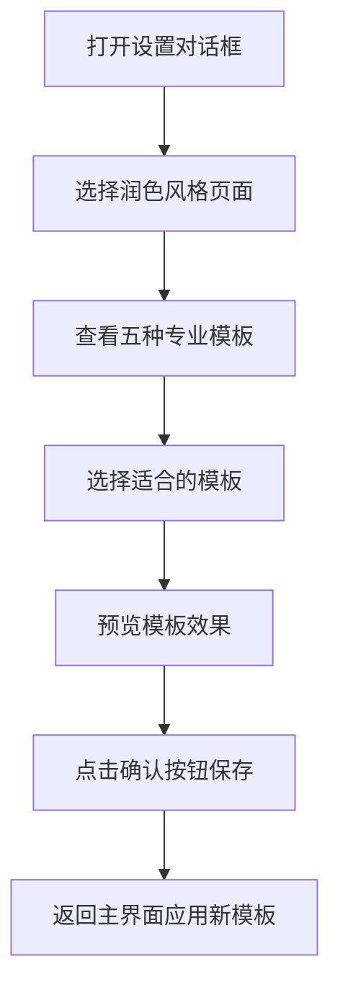

# 小说润色器功能优化需求文档

## 1. 产品概述

本次优化旨在提升小说润色器的专业性和用户体验，通过更新内置润色模板和优化UI组件设计，为不同领域的内容创作者提供更精准的润色服务。

## 2. 核心功能

### 2.1 用户角色
| 角色 | 使用场景 | 核心需求 |
|------|----------|----------|
| 影视编剧 | 剧本创作和修改 | 专业的戏剧性表达和对话润色 |
| 游戏策划 | 游戏剧情和文案创作 | 沉浸式叙事和角色塑造 |
| 内容创作者 | 社交媒体内容制作 | 吸引眼球的表达方式 |
| 企业文案 | 品牌宣传和对外传播 | 专业严谨的商务表达 |
| 政务工作者 | 公文和新闻稿撰写 | 准确规范的政务表达 |

### 2.2 功能模块

本次优化涉及以下主要模块：
1. **润色模板管理**：更新内置默认模板，提供五种专业化润色风格
2. **设置界面优化**：美化按钮设计，优化布局和尺寸
3. **配置管理**：保持现有架构，确保新模板的正确加载和保存

### 2.3 页面详情

| 页面名称 | 模块名称 | 功能描述 |
|----------|----------|----------|
| 主界面 | 润色模板选择 | 显示新的五种专业模板选项，支持多选组合 |
| 设置对话框 | 润色风格配置 | 展示优化后的模板列表，支持预览和编辑 |
| 设置对话框 | 按钮操作区 | 美化确认、取消、应用按钮的外观和交互效果 |

## 3. 核心流程

用户选择润色模板的主要操作流程：

## 4. 用户界面设计

### 4.1 设计风格
- **主色调**：保持现有深色主题风格
- **按钮样式**：现代化圆角设计，增加悬停和点击效果
- **字体**：清晰易读的中文字体，合适的字号
- **布局**：紧凑但不拥挤，确保组件间距合理
- **图标**：简洁的矢量图标，与整体风格协调

### 4.2 页面设计概览

| 页面名称 | 模块名称 | UI元素 |
|----------|----------|---------|
| 设置对话框 | 润色模板区域 | 五个专业模板的复选框，每个带有详细说明tooltip |
| 设置对话框 | 按钮操作区 | 重新设计的确认、取消、应用按钮，统一尺寸和样式 |
| 设置对话框 | 整体布局 | 优化间距和对齐，确保不同分辨率下的适配性 |

### 4.3 响应式设计
- 支持不同窗口尺寸下的自适应布局
- 按钮和文本在高DPI显示器上的清晰显示
- 保持在不同主题下的一致性表现