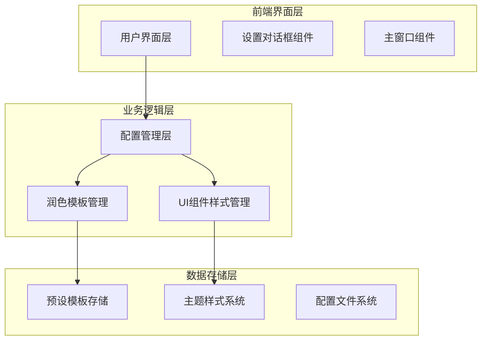

# 小说润色器技术架构优化文档

## 1. 架构设计



## 2. 技术描述

- 前端框架：PyQt5 + Python 3.13
- 配置管理：JSON文件存储 + ConfigManager类
- 样式系统：Qt样式表 + ThemeManager
- 模板管理：PolishStyle数据类 + StyleManager

## 3. 核心组件定义

### 3.1 润色模板数据结构

```python
@dataclass
class PolishStyle:
    id: str
    name: str
    prompt: str
    is_preset: bool
    parameters: Dict[str, Any]
```

### 3.2 新增专业模板定义

```python
PRESET_STYLES = {
    "professional_screenwriter": PolishStyle(
        id="professional_screenwriter",
        name="专业编剧",
        prompt="你是一位资深影视编剧，请对以下文本进行专业的戏剧性润色...",
        is_preset=True,
        parameters={"temperature": 0.7}
    ),
    "game_copywriter": PolishStyle(
        id="game_copywriter", 
        name="游戏文案",
        prompt="你是一位专业游戏文案策划，请对以下文本进行游戏化润色...",
        is_preset=True,
        parameters={"temperature": 0.6}
    ),
    # ... 其他模板
}
```

## 4. UI组件优化方案

### 4.1 按钮样式优化

```css
QPushButton {
    background-color: #0e639c;
    border: 1px solid #0e639c;
    border-radius: 6px;
    padding: 8px 16px;
    color: #ffffff;
    font-weight: 500;
    min-width: 60px;
    min-height: 32px;
}

QPushButton:hover {
    background-color: #1177bb;
    border-color: #1177bb;
}

QPushButton:pressed {
    background-color: #0d5a9a;
    border-color: #0d5a9a;
}
```

### 4.2 布局优化策略

- 使用QHBoxLayout和QVBoxLayout进行精确布局控制
- 设置合理的margins和spacing值
- 使用addStretch()确保组件对齐
- 设置固定的最小尺寸防止组件过小

## 5. 配置迁移方案

### 5.1 版本兼容性处理

```python
def _migrate_config(self) -> None:
    """配置迁移逻辑"""
    # 备份现有配置
    self.storage.backup(".optimization_backup")
    
    # 更新预设模板
    self._update_preset_styles()
    
    # 保持用户自定义配置
    self._preserve_custom_settings()
    
    # 更新版本号
    self._config.version = "2.1.0"
```

### 5.2 数据模型更新

```python
# 新增专业模板配置
PROFESSIONAL_TEMPLATES = {
    "professional_screenwriter": {
        "name": "专业编剧",
        "prompt": "详细的编剧润色提示词...",
        "parameters": {"temperature": 0.7, "max_tokens": 2000}
    },
    "game_copywriter": {
        "name": "游戏文案", 
        "prompt": "详细的游戏文案润色提示词...",
        "parameters": {"temperature": 0.6, "max_tokens": 1500}
    },
    "xiaohongshu_expert": {
        "name": "小红书达人",
        "prompt": "详细的小红书风格润色提示词...",
        "parameters": {"temperature": 0.8, "max_tokens": 1000}
    },
    "corporate_pr": {
        "name": "大厂外宣",
        "prompt": "详细的企业外宣润色提示词...",
        "parameters": {"temperature": 0.4, "max_tokens": 2000}
    },
    "political_rigorous": {
        "name": "政治严谨",
        "prompt": "详细的政务文件润色提示词...",
        "parameters": {"temperature": 0.3, "max_tokens": 2500}
    }
}
```

## 6. 实现优先级

1. **高优先级**：更新ConfigManager中的PRESET_STYLES定义
2. **高优先级**：优化SettingsDialog中的按钮样式和布局
3. **中优先级**：添加配置迁移逻辑确保向后兼容
4. **中优先级**：更新主题样式确保新按钮在不同主题下正常显示
5. **低优先级**：添加新模板的使用统计和反馈机制