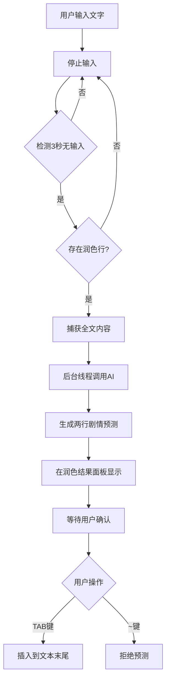

# 智能剧情预测功能说明

## 功能概述

本功能实现了基于AI的智能剧情预测，当用户停止输入一定时间后，系统会自动根据当前文本内容预测接下来的两行剧情发展。

## 功能特性

### 1. 自动触发机制

**触发条件（需同时满足）：**
- ✅ 用户停止输入文字达到 **3秒**（精确度±0.5秒）
- ✅ 存在润色行（包括历史存在或当前存在）

**设计理念：**
- 仅在用户有润色需求时才触发预测，避免无意义的API调用
- 3秒等待时间给予用户充足的思考时间，不会过早打断

### 2. 执行流程



### 3. 输出处理

**显示格式：**
- 预测内容显示在润色结果面板中
- 使用特殊标记 `[预测L行号]` 区分普通润色
- 显示当前文本末尾行号+1和+2的位置

**示例：**
```
[预测L15] 他猛地回头，却只看见空荡荡的庭院。
[预测L16] 黑暗中传来细微的脚步声，正在缓慢靠近。
```

### 4. 用户确认机制

**操作方式：**
- **TAB键**：确认并插入预测内容到文本末尾
- **~ 键**：拒绝所有预测内容

**特点：**
- ✅ 预测内容在确认前可编辑
- ✅ 保持原始文本内容不变
- ✅ 支持批量处理多个预测结果

### 5. 性能要求

**响应速度：**
- ⏱️ 输入停止检测：3秒（±0.5秒）
- 🔄 后台线程执行：不阻塞UI
- ⚡ 用户可继续编辑：不影响正常使用

**技术实现：**
- 使用 `QTimer` 实现精确的3秒检测
- 使用 `QThreadPool` 后台执行AI请求
- 使用 `PlotPredictionWorker` 异步处理

## 技术架构

### 核心组件

#### 1. VsCodeEditor（编辑器增强）
```python
# 新增信号
inputStoppedForPrediction = pyqtSignal()

# 输入停止检测定时器
self._input_stop_timer = QTimer()
self._input_stop_timer.setSingleShot(True)
self._input_stop_timer.setInterval(3000)  # 3秒
```

#### 2. AIClient（API客户端）
```python
def predict_plot_continuation(self, full_text: str) -> str:
    """预测剧情发展，生成接下来两行内容"""
    # 调用大模型API
    # 温度设置为0.7以增加创造性
    # 返回预测的两行内容
```

#### 3. PolishResultPanel（结果面板）
```python
# 新增参数
def add_result(
    self, 
    original_text: str, 
    polished_text: str, 
    line_number: int = -1,
    is_prediction: bool = False  # 标记是否为预测内容
):
    # 显示格式：[预测L行号] 或 [L行号]
```

#### 4. PlotPredictionWorker（后台工作线程）
```python
class PlotPredictionWorker(QtCore.QRunnable):
    """后台执行剧情预测，不阻塞UI"""
    def run(self):
        predicted_text = self._client.predict_plot_continuation(self._full_text)
        self.signals.finished.emit(predicted_text)
```

### 数据流

```
用户输入 → 3秒定时器 → 检测润色行 → 后台AI请求 → 解析结果 → 显示面板 → 用户确认 → 插入文本
```

## 使用示例

### 场景1：正常使用流程

1. **用户编写小说**
   ```
   夜幕降临，古老的城堡笼罩在一片阴影之中。
   李明小心翼翼地推开了那扇锈迹斑斑的大门。
   突然，一阵冷风从背后袭来。
   ```

2. **停止输入3秒**
   - 系统检测到停止输入
   - 检查润色历史（存在）
   - 触发剧情预测

3. **AI生成预测**
   ```
   [预测L4] 他猛地回头，却只看见空荡荡的庭院。
   [预测L5] 黑暗中传来细微的脚步声，正在缓慢靠近。
   ```

4. **用户确认**
   - 按 `TAB` 键确认插入
   - 或按 `~` 键拒绝

### 场景2：无润色历史

- 用户输入文字
- 停止输入3秒
- **不触发预测**（因为没有润色历史）

### 场景3：编辑预测内容

1. 系统生成预测
2. 用户在面板中修改预测文本
3. 按 `TAB` 键插入修改后的内容

## 配置说明

### AI模型参数

```python
# 在 api_client.py 中
payload = {
    "model": self._model,
    "temperature": 0.7,  # 较高温度增加创造性
    "messages": [...]
}
```

### 提示词模板

```python
system_content = (
    "你是一位资深中文小说作家，擅长剧情预测与续写。"
    "请根据用户提供的现有剧情，预测并生成接下来最合理的两行内容。"
    "要求：1）保持风格统一；2）剧情连贯自然；3）只输出两行文本，不要任何解释；4）每行文本应独立成句。"
)
```

## 注意事项

⚠️ **重要提示：**

1. **API密钥配置**
   - 确保 `.env` 文件中配置了有效的 `AI_API_KEY`
   - 检查 `AI_MODEL` 是否支持剧情续写功能

2. **网络连接**
   - 功能需要网络连接到AI服务
   - 后台执行不影响用户继续编辑

3. **性能考虑**
   - 3秒检测避免频繁API调用
   - 仅在有润色历史时触发，减少无效请求

4. **用户体验**
   - 预测内容可编辑，给予用户完全控制权
   - 使用特殊标记区分预测和普通润色
   - 支持批量确认或拒绝

## 测试验证

### 运行测试脚本

```bash
python test_prediction_feature.py
```

### 测试内容

✅ **定时器逻辑测试**
- 验证3秒检测精确度（±0.5秒）

✅ **API调用测试**
- 验证剧情预测API正常工作
- 验证返回结果解析正确

✅ **集成测试**
- 验证完整流程运行正常

## 故障排查

### 问题1：预测不触发

**检查清单：**
- [ ] 是否存在润色历史？
- [ ] 是否停止输入至少3秒？
- [ ] API密钥是否配置正确？

### 问题2：预测结果为空

**可能原因：**
- AI模型返回格式不符合预期
- 网络连接问题
- API配额不足

**解决方案：**
- 查看控制台错误日志
- 检查 `.env` 配置
- 测试API连接

### 问题3：插入位置错误

**检查：**
- 行号计算逻辑（末尾行号+1和+2）
- 是否有其他编辑操作干扰

## 版本历史

### v1.0.0 (2025-10-24)
- ✨ 初始版本发布
- ✅ 3秒输入停止检测
- ✅ AI剧情预测功能
- ✅ 润色结果面板显示
- ✅ 用户确认机制
- ✅ 后台线程执行

## 相关文件

- `app/main.py` - 主窗口逻辑
- `app/api_client.py` - AI客户端
- `app/widgets/polish_result_panel.py` - 结果面板
- `test_prediction_feature.py` - 功能测试脚本

## 未来优化方向

🔮 **计划中的改进：**

1. **智能预测条数**
   - 根据上下文长度动态调整预测行数
   - 支持用户自定义预测行数

2. **风格匹配**
   - 分析当前文本风格
   - 预测时保持一致的写作风格

3. **多候选生成**
   - 生成多个预测候选
   - 用户可选择最合适的版本

4. **预测历史**
   - 记录预测历史
   - 支持撤销/重做操作
